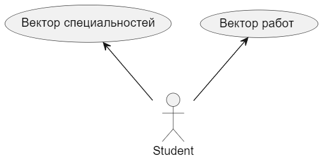
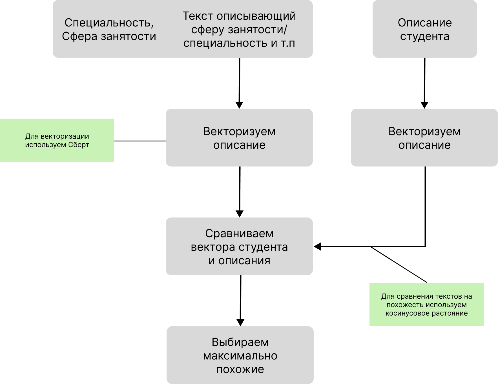

# Описание сущностей

Студент описывается двумя векторами: 
- вектор специальности $1\times N_{\text{число специальностей}}$
- вектор професий $1\times N_{\text{число професий}}$ 

Профессии описываются тензорами размерности $64 \times 1024$

Специальности описываются тензорами размерности $128 \times 1024$

# Описание алгоритма

1) Парсим с сайтов текстовые описания студента и нормализуем их;
3) Векторизуем описания;
4) Получаем результирующий вектор для описаний (просто сумируем вектора)
5) Сравниваем с результирующим вектором профессии/специальности, по косинусному растоянию;
6) Выбираем максимально близкие для студента профессии/специальности по полученным расстояниям;

